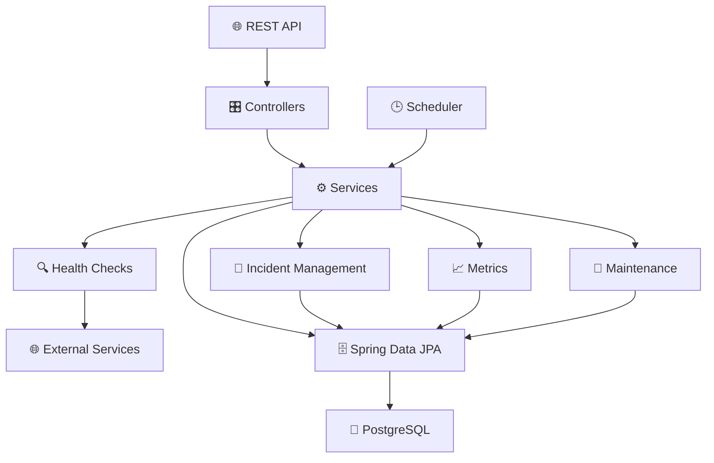
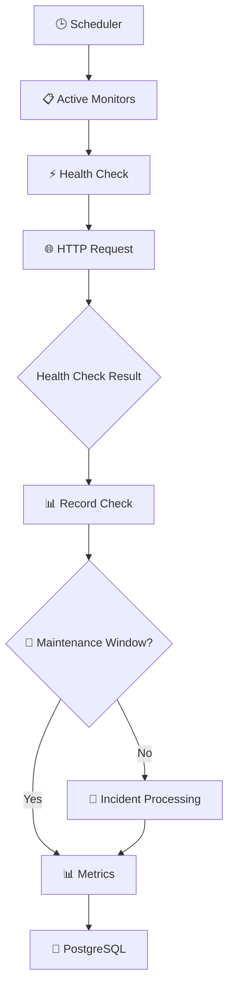

# 🚨 Incident Management API

A Spring Boot monitoring and incident management API for tracking the availability and performance of external services.

The application provides configurable service monitors, automated and on-demand health checks, incident detection and
management, maintenance windows, monitoring metrics, and dashboard information.

---

# ✨ Features

## 📡 Monitor Management

Monitors represent external services that the application checks for availability and performance.

Each monitor supports:

* 🏷️ **Name**
* 🌐 **Target URL**
* 🎯 **Expected HTTP status**
* ⏱️ **Check interval**
* 📧 **Callback email**
* 🏷️ **Tags** for grouping and filtering
* ⚡ **Expected latency**
* 🚧 **Maintenance window**
* 🟢 **Active / inactive state**

Monitors are persisted using Spring Data JPA.

---

## ⚙️ Automated Health Checks

Active monitors are checked automatically by the monitoring system.

Health checks:

* 🌐 Send an HTTP request to the configured target
* 🎯 Validate the returned HTTP status
* ⚡ Measure response latency
* 📊 Record the check result
* 🚨 Process failures as incidents
* 🚧 Respect active maintenance windows
* 🐘 Persist monitoring data

The application uses Spring Scheduling and asynchronous execution to perform monitoring tasks.

---

## 🧪 Manual Health Checks

Individual monitors can be checked on demand through the REST API.

Manual checks use the application's monitoring service layer and provide an immediate way to execute a health check for
a specific monitor.

---

## 🚧 Maintenance Windows

Maintenance windows allow planned downtime to be configured for a monitor.

A maintenance window consists of:

* 🕒 Start time
* 🕒 End time

During an active maintenance window, monitoring can continue while incident creation is suppressed for expected
maintenance-related failures.

Maintenance windows can be activated and deactivated independently of the monitor's main configuration.

---

## 🚨 Incident Management

The application records incidents when monitored services fail their configured health checks.

Incidents can contain:

* 🌐 Target URL
* ⚠️ Incident type
* 🎯 Expected HTTP status
* 📉 Actual HTTP status
* 📝 Failure reason
* 📧 Callback email
* 🕒 Creation timestamp
* 🔓 Open / resolved state
* ✅ Resolution timestamp

Incidents can be:

* 📋 Retrieved
* 🔍 Filtered by monitor
* 🔓 Filtered to open incidents
* ✅ Resolved
* 🗑️ Deleted

---

## 📈 Metrics

Historical health-check results are aggregated into monitor-level metrics.

Available metrics include:

* 📊 Total checks
* ✅ Successful checks
* ❌ Failed checks
* 📈 Uptime percentage
* ⚡ Average latency
* 🚨 Open incident count

Metrics can optionally be retrieved using a cutoff date.

---

## 📊 Dashboard

The API provides a dashboard summary containing:

* 🖥️ Total monitors
* 🚨 Total incidents
* 🔓 Open incidents
* ✅ Closed incidents

---

# 📡 API Endpoints

## 🛠️ Monitor Administration

Base path: `/api/admin/monitors`

| Method   | Endpoint                           | Description                                       |
|----------|------------------------------------|---------------------------------------------------|
| `POST`   | `/api/admin/monitors`              | ➕ Create a monitor                                |
| `GET`    | `/api/admin/monitors`              | 📋 Retrieve monitors, optionally filtered by tags |
| `GET`    | `/api/admin/monitors/{id}`         | 🔍 Retrieve a monitor by ID                       |
| `PUT`    | `/api/admin/monitors/{id}`         | ✏️ Update monitor configuration                   |
| `DELETE` | `/api/admin/monitors/{id}`         | 🗑️ Delete a monitor                              |
| `PATCH`  | `/api/admin/monitors/{id}/enable`  | 🟢 Enable a monitor                               |
| `PATCH`  | `/api/admin/monitors/{id}/disable` | 🔴 Disable a monitor                              |

### Tag filtering

The monitor collection endpoint supports an optional `tags` query parameter.

```text
GET /api/admin/monitors?tags=production&tags=critical
```

---

## 🚧 Maintenance Windows

Base path: `/api/admin/monitors`

| Method   | Endpoint                               | Description                       |
|----------|----------------------------------------|-----------------------------------|
| `POST`   | `/api/admin/monitors/{id}/maintenance` | 🚧 Activate a maintenance window  |
| `DELETE` | `/api/admin/monitors/{id}/maintenance` | ✅ Deactivate a maintenance window |

---

## 🧪 Manual Health Checks

Base path: `/api/monitors`

| Method | Endpoint                    | Description                            |
|--------|-----------------------------|----------------------------------------|
| `GET`  | `/api/monitors/{monitorId}` | ⚡ Execute a health check for a monitor |

---

## 🚨 Incident Management

### Incident Retrieval

Base path: `/api/incidents`

| Method | Endpoint                                             | Description                         |
|--------|------------------------------------------------------|-------------------------------------|
| `GET`  | `/api/incidents`                                     | 📋 Retrieve incidents               |
| `GET`  | `/api/incidents?monitorId={monitorId}`               | 🔍 Filter incidents by monitor      |
| `GET`  | `/api/incidents?openOnly=true`                       | 🔓 Retrieve open incidents          |
| `GET`  | `/api/incidents?monitorId={monitorId}&openOnly=true` | 🔍 Filter open incidents by monitor |

The `openOnly` parameter controls whether only unresolved incidents are returned.

### Incident Administration

Base path: `/api/admin/incidents`

| Method   | Endpoint                                    | Description            |
|----------|---------------------------------------------|------------------------|
| `PATCH`  | `/api/admin/incidents/{incidentId}/resolve` | ✅ Resolve an incident  |
| `DELETE` | `/api/admin/incidents/{incidentId}`         | 🗑️ Delete an incident |

---

## 📈 Metrics

Base path: `/api/metrics/monitors`

| Method | Endpoint                            | Description                       |
|--------|-------------------------------------|-----------------------------------|
| `GET`  | `/api/metrics/monitors/{monitorId}` | 📊 Retrieve metrics for a monitor |

Supports the optional `cutoffDate` query parameter using the `YYYY-MM-DD` format.

---

## 📊 Dashboard

| Method | Endpoint         | Description                       |
|--------|------------------|-----------------------------------|
| `GET`  | `/api/dashboard` | 📊 Retrieve dashboard information |

---

# 📦 Data Models

## Monitor Request

Used when creating or updating a monitor.

| Field               | Type                | Required | Description            |
|---------------------|---------------------|----------|------------------------|
| `name`              | `string`            | ✅        | Monitor name           |
| `url`               | `string`            | ✅        | Target URL             |
| `expectedStatus`    | `integer`           | ❌        | Expected HTTP status   |
| `intervalSeconds`   | `integer`           | ❌        | Monitoring interval    |
| `callbackEmail`     | `string`            | ✅        | Callback email address |
| `tags`              | `string[]`          | ❌        | Monitor tags           |
| `maintenanceWindow` | `MaintenanceWindow` | ❌        | Maintenance period     |
| `expectedLatency`   | `integer`           | ❌        | Expected latency       |

---

## Monitor Response

| Field               | Type                | Description                   |
|---------------------|---------------------|-------------------------------|
| `id`                | `integer`           | Monitor identifier            |
| `name`              | `string`            | Monitor name                  |
| `url`               | `string`            | Target URL                    |
| `expectedStatus`    | `integer`           | Expected HTTP status          |
| `intervalSeconds`   | `integer`           | Monitoring interval           |
| `active`            | `boolean`           | Whether monitoring is enabled |
| `callbackEmail`     | `string`            | Callback email                |
| `createdAt`         | `date-time`         | Creation timestamp            |
| `tags`              | `string[]`          | Monitor tags                  |
| `maintenanceWindow` | `MaintenanceWindow` | Active maintenance window     |
| `expectedLatency`   | `integer`           | Expected latency              |

---

## Maintenance Window

| Field   | Type        | Description  |
|---------|-------------|--------------|
| `start` | `date-time` | Window start |
| `end`   | `date-time` | Window end   |

---

## Incident Response

| Field            | Type        | Description                  |
|------------------|-------------|------------------------------|
| `url`            | `string`    | Monitored URL                |
| `incidentType`   | `string`    | Type of incident             |
| `expectedStatus` | `integer`   | Expected HTTP status         |
| `actualStatus`   | `integer`   | Actual HTTP status           |
| `failureReason`  | `string`    | Reason for failure           |
| `callbackEmail`  | `string`    | Callback email               |
| `createdAt`      | `date-time` | Incident creation time       |
| `openIncident`   | `boolean`   | Whether the incident is open |
| `resolvedAt`     | `date-time` | Incident resolution time     |

---

## Metrics Response

| Field              | Type      | Description                  |
|--------------------|-----------|------------------------------|
| `monitorId`        | `integer` | Monitor identifier           |
| `window`           | `string`  | Reporting window             |
| `totalChecks`      | `integer` | Total number of checks       |
| `successfulChecks` | `integer` | Successful checks            |
| `failedChecks`     | `integer` | Failed checks                |
| `uptimePercentage` | `double`  | Calculated uptime percentage |
| `averageLatencyMs` | `double`  | Average response latency     |
| `openIncidents`    | `integer` | Number of open incidents     |

---

## Dashboard Response

| Field             | Type      | Description                |
|-------------------|-----------|----------------------------|
| `totalMonitors`   | `integer` | Total number of monitors   |
| `totalIncidents`  | `integer` | Total number of incidents  |
| `openIncidents`   | `integer` | Number of open incidents   |
| `closedIncidents` | `integer` | Number of closed incidents |

---

# 🏗️ Architecture

The application follows a layered Spring architecture with dedicated controllers, services, monitoring logic, incident
management, metrics, and persistence.



### Monitoring flow



---

# 🛠️ Technology Stack

* ☕ **Java 21**
* 🌱 **Spring Boot 3.x**
* 🐘 **PostgreSQL**
* 🗄️ **Spring Data JPA**
* ⏰ **Spring Scheduling**
* ⚡ **Spring Async**
* 🔁 **Spring Retry**
* 🗺️ **MapStruct**
* ✅ **Jakarta Bean Validation**
* 📖 **OpenAPI 3.1 / Swagger**
