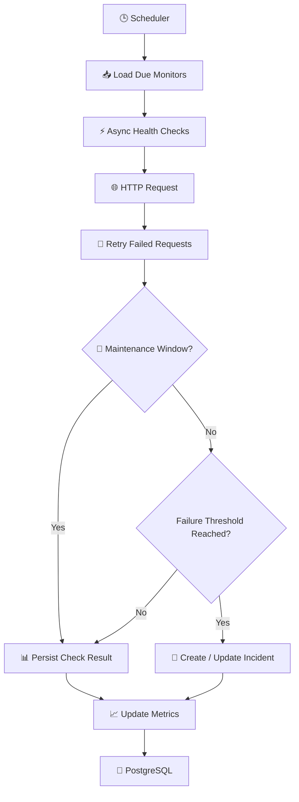

# 🚨 Incident Management API

A backend monitoring system for tracking external services through automated and on-demand health checks. The
application detects service degradation, records incidents, provides historical availability metrics, and supports
planned maintenance windows to suppress expected outages.

---

# ✨ Features

## 📡 Monitor Management

Users can define and manage monitors representing external services.

Each monitor supports:

* 🏷️ Name
* 🌐 Target URL
* 🎯 Expected HTTP status code
* ⏱️ Check interval (seconds)
* 📧 Callback email
* 🏷️ Optional tag for grouping and filtering
* 🚧 Maintenance window scheduling
* 🔢 Configurable consecutive failure threshold
* 🔄 Active / inactive state

Monitors are persisted in PostgreSQL using Spring Data JPA.

---

## ⚙️ Automated Health Checks

A background scheduler continuously evaluates monitors that are due for execution.

The monitoring pipeline leverages:

* Spring Scheduling
* Spring Async
* Spring Retry

Each execution:

* 🌍 Sends an HTTP GET request
* ✅ Validates the returned HTTP status code
* 🔁 Retries transient failures
* ⚡ Executes checks concurrently
* 📊 Records health check results
* 🐘 Persists data using Spring Data JPA

---

## 🧪 Manual Health Checks

Health checks can also be executed on demand through a dedicated endpoint.

Manual executions reuse the exact same service layer as scheduled checks, ensuring consistent retry, validation,
incident creation and metrics collection.

---

## 🚧 Maintenance Windows

Monitors can be placed into a scheduled maintenance window.

During an active maintenance window:

* 🚧 Health checks continue to execute
* 🚫 Incident creation is suppressed
* 📊 Metrics continue to be collected
* 🕒 Maintenance can be activated or removed independently of monitor configuration

---

## 🚨 Incident Management

When a monitor exceeds its configured consecutive failure threshold outside an active maintenance window, an incident is
automatically created.

Detected failures include:

* ❌ Unexpected HTTP status codes
* ⏳ Connection failures
* 🌐 Request timeouts after retry attempts

Each incident records:

* 🔗 Monitor reference
* 🌐 Target URL
* ⚠️ Incident type
* 🎯 Expected HTTP status
* 📉 Actual HTTP status (when available)
* 📝 Failure reason
* 📧 Callback email
* 🧬 Fingerprint for duplicate detection
* 🕒 Created timestamp
* 🔓 Open / resolved state

Duplicate incidents are automatically detected using fingerprinting to prevent multiple open incidents representing the
same underlying failure.

---

## 📈 Metrics

Historical health check results are aggregated into monitor metrics including:

* 📊 Total health checks
* ✅ Successful checks
* ❌ Failed checks
* 📈 Uptime percentage
* ⚡ Average response latency
* 🚨 Open incident count

Metrics can be queried for any reporting period using an optional cutoff date.

---

# 📡 API Endpoints

---

## 🛠 Admin Monitor Management

Base path: `/api/admin/monitors`

| Method | Endpoint                           | Description                                      |
|--------|------------------------------------|--------------------------------------------------|
| POST   | `/api/admin/monitors`              | ➕ Create a new monitor                           |
| GET    | `/api/admin/monitors`              | 📋 Retrieve all monitors (optional `tag` filter) |
| GET    | `/api/admin/monitors/{id}`         | 🔍 Retrieve monitor by ID                        |
| PUT    | `/api/admin/monitors/{id}`         | ✏️ Update monitor configuration                  |
| PATCH  | `/api/admin/monitors/{id}/enable`  | 🟢 Enable monitor                                |
| PATCH  | `/api/admin/monitors/{id}/disable` | 🔴 Disable monitor                               |
| POST   | `/api/admin/monitors/run-all`      | 🚀 Execute health checks for all active monitors |
| DELETE | `/api/admin/monitors/{id}`         | 🗑️ Delete monitor                               |

---

## 🚧 Maintenance Window Management

Base path: `/api/admin/monitors`

| Method | Endpoint                               | Description                                  |
|--------|----------------------------------------|----------------------------------------------|
| POST   | `/api/admin/monitors/{id}/maintenance` | 🚧 Schedule or activate a maintenance window |
| DELETE | `/api/admin/monitors/{id}/maintenance` | ✅ Remove the active maintenance window       |

---

## 🧪 Manual Monitor Execution

Base path: `/api/monitors`

| Method | Endpoint                    | Description                         |
|--------|-----------------------------|-------------------------------------|
| GET    | `/api/monitors/{monitorId}` | ⚡ Execute an on-demand health check |

---

## 🚨 Incident Retrieval

Base path: `/api/incidents`

| Method | Endpoint                                   | Description                         |
|--------|--------------------------------------------|-------------------------------------|
| GET    | `/api/incidents/{monitorId}`               | 📊 Retrieve incidents for a monitor |
| GET    | `/api/incidents/{monitorId}?openOnly=true` | 🔓 Retrieve only open incidents     |

---

## 🛠 Admin Incident Management

Base path: `/api/admin/incidents`

| Method | Endpoint                                    | Description                    |
|--------|---------------------------------------------|--------------------------------|
| GET    | `/api/admin/incidents`                      | 📋 Retrieve all incidents      |
| GET    | `/api/admin/incidents/open`                 | 🔓 Retrieve all open incidents |
| PATCH  | `/api/admin/incidents/{incidentId}/resolve` | ✅ Resolve an incident          |
| DELETE | `/api/admin/incidents/{incidentId}`         | 🗑️ Delete an incident         |

---

## 📈 Metrics API

Base path: `/api/metrics/monitors`

| Method | Endpoint                            | Description                                                              |
|--------|-------------------------------------|--------------------------------------------------------------------------|
| GET    | `/api/metrics/monitors/{monitorId}` | 📊 Retrieve monitor metrics (`cutoffDate` optional, format `YYYY-MM-DD`) |

Metrics are calculated from persisted health check history.

---

# 🛠 Technology Stack

* ☕ Java 21
* 🌱 Spring Boot 3.x
* 🐘 PostgreSQL
* 🗄️ Spring Data JPA
* ⏰ Spring Scheduling
* ⚡ Spring Async
* 🔁 Spring Retry
* 🗺️ MapStruct
* ✅ Jakarta Bean Validation
* 📖 OpenAPI / Swagger

---

# 🧠 Architecture Overview

